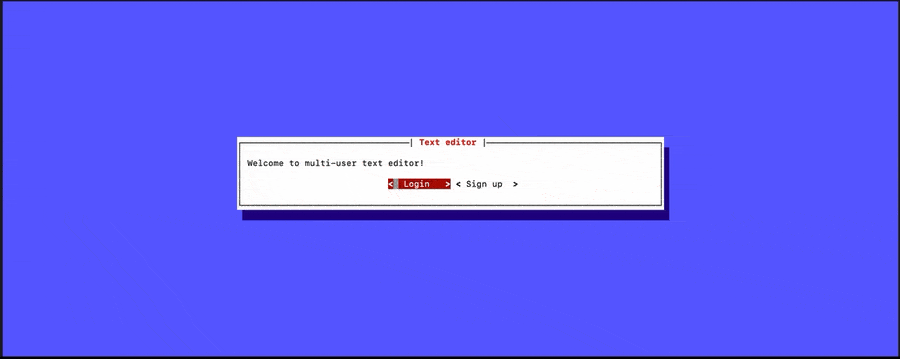

<h1 align="center">
  <br>
  Multitext Client
  <br>
</h1>

<h4 align="center">CRDT-based multi-user collaborative console text editor written in Python.</h4>

<p align="center">
  
</p>

## How To Use

Firstly, make sure that you have [multitext-server](https://github.com/usernamedt/multitext-server) up and running.

To clone and run this application, you'll need Git and Python 3.7+ installed on your computer. From your command line:

```bash
# Clone this repository
$ git clone https://github.com/usernamedt/multitext-client

# Go into the repository
$ cd multitext-client

# Install dependencies
$ pip3 install -r requirements.txt

# Run the app
$ python3 launch.py -i multitext.server.ip.address -p port
```

On the launch, you will be asked to log in with existing account or create a
 new one.
 After login, you can open existing file (yours or shared with you by other
  users) or you can create a new file and edit it from as many devices
  simultaneously (like in Google Docs). 
  
To open menu, press Control-C.

To use cut/copy/paste/delete options open menu and go to Edit section.
Also, you can past the text straight from the terminal app (experimental
 feature)  

If you want to share the file with
   another user, choose File > Share in menu and then specify a username of
    the user you want to share your file with.  
    
To save file, choose File > Save in menu

## License

MIT
